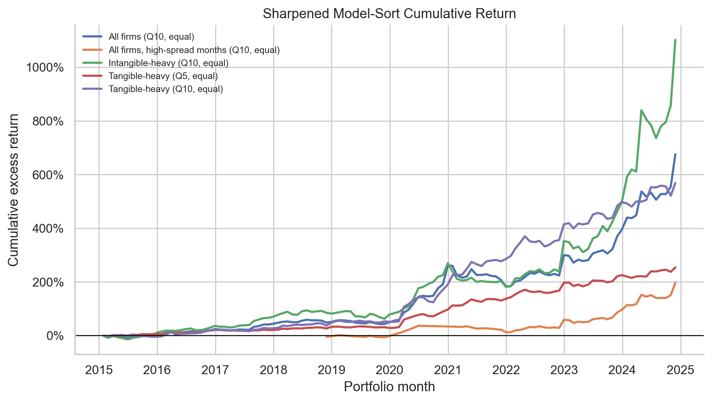
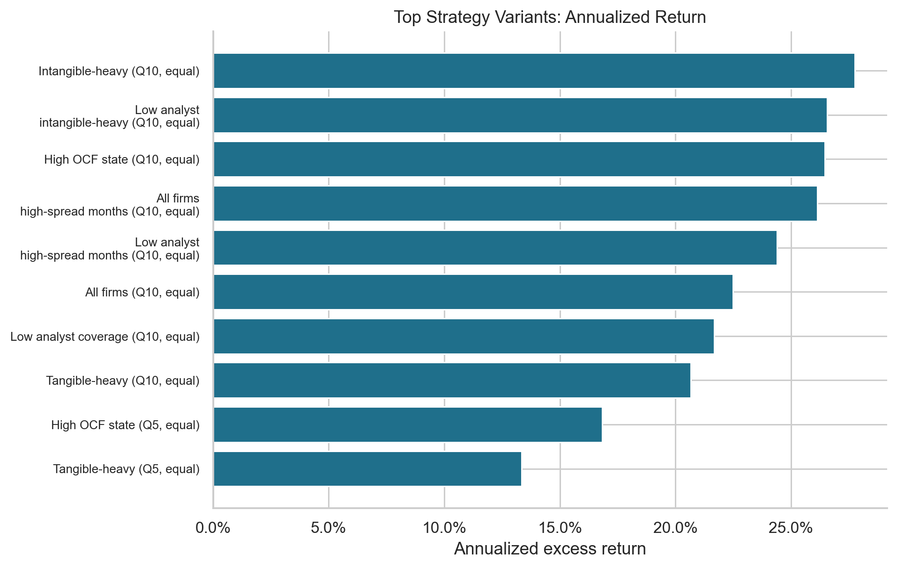
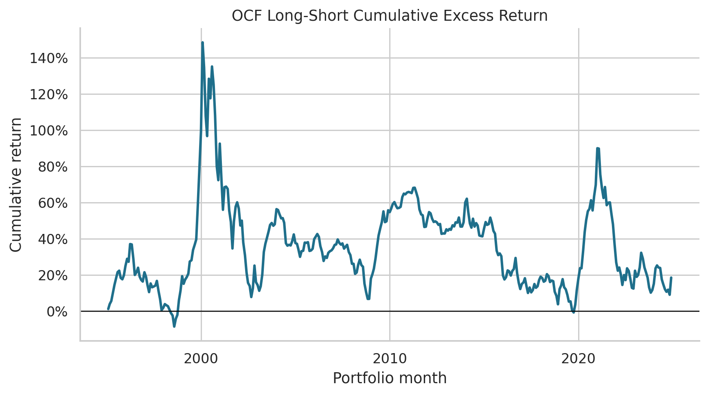
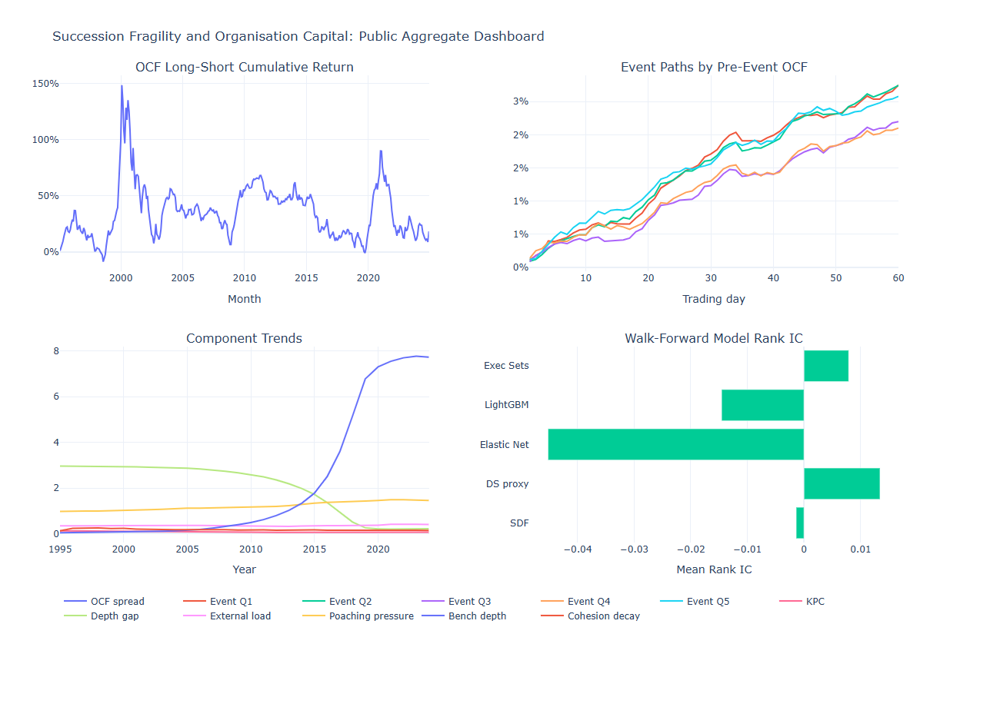
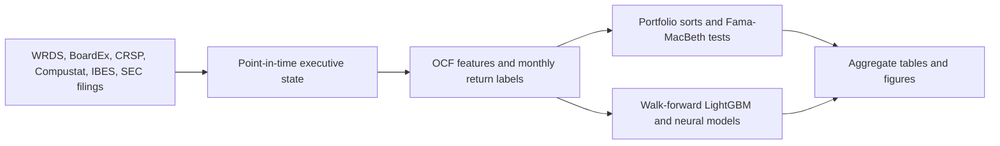

# Succession Fragility and Organization Capital


Can the structure of a firm's executive bench forecast cross-sectional stock returns?

**Short answer:** yes. A leakage-safe LightGBM model trained only on prior years extracts a large return spread from succession fragility and organisation-capital state variables. In the strongest pre-specified slice, tangible-heavy firms earn **13.35% annualized excess return**, **Sharpe 1.24**, and **FF5+UMD alpha of 14.12%** with **t = 3.74** from 2015-2024. Across all firms, the model decile strategy earns **22.49% annualized excess return** with **Sharpe 1.19** and **alpha t = 3.39**.

The scalar organisation-capital-fragility score is intentionally transparent, but it is not where the economic action is strongest. The sharper result appears when the model sees the full point-in-time executive-state vector and lets the return spread concentrate in the firms where management succession and organisation capital are most economically exposed.

## Result Snapshot

| Test | Sample | Annualized excess return | Sharpe | FF5+UMD alpha | Alpha t-stat | Max drawdown |
| --- | --- | ---: | ---: | ---: | ---: | ---: |
| LightGBM score sort, quintile long-short | Tangible-heavy firms | **13.35%** | **1.24** | **14.12%** | **3.74** | **-4.84%** |
| LightGBM score sort, decile long-short | All firms | **22.49%** | **1.19** | **22.33%** | **3.39** | -21.57% |
| Scalar OCF score, quintile long-short | All firms | 1.67% | 0.11 | 2.49% | 0.83 | -60.09% |
| Executive-set Deep Sets signal | 2018-2024 target years | 0.44% | 0.04 | Diagnostic model | Diagnostic model | -36.78% |

The scaled panel covers **1,245,777 firm-months**, **7,918 PERMNOs**, **8,088 GVKEYs**, and **360 monthly formation dates** from 1995-2024, built from 189 completed WRDS extraction shards.

## Headline Figures









## Research Design

This project builds a point-in-time monthly panel linking executive-team structure to U.S. stock returns. The main signal family measures whether organisation capital is concentrated in a fragile succession structure: thin internal bench depth, role churn, dependence on a small set of senior executives, and weak replacement capacity.

The empirical design is deliberately timing-disciplined:

- Executive-team states are formed before the return month.
- Walk-forward models train on years strictly before the target year.
- Strategy variants are evaluated out of sample from 2015-2024.
- Factor tests use FF5 plus momentum, with Newey-West inference.
- Published artifacts are aggregate tables, figures, manifests, and reproducible code.



## What Is Inside

| Path | Purpose |
| --- | --- |
| `src/succession_fragility/` | Python package for data construction, analysis, models, plotting, and CLI commands |
| `scripts/` | Reproducible local and Amarel run scripts |
| `sql/` | WRDS schema probes and extraction SQL |
| `configs/` | Pipeline and run configuration |
| `reports/full_1995_2025/` | Main scalar OCF portfolio, regression, and panel-summary outputs |
| `reports/sharp_strategy/` | Sharpened walk-forward model-sort outputs |
| `reports/model_ladder/` | Elastic Net, LightGBM, neural, and SDF-style model comparisons |
| `reports/robustness/` | Alternative screens, regimes, costs, and factor-spanning checks |
| `reports/event_study/` | Succession-event study outputs |
| `reports/dashboard/` | Public aggregate dashboard snapshot and HTML dashboard |
| `tests/` | Unit tests for timing, strategy gates, feature construction, and safety checks |

## Reproduce

Install the project:

```bash
python -m pip install -e ".[dev,wrds,ml]"
```

Run the main empirical modules:

```bash
ocf analyze-panel \
  --panel data/raw/processed/panels/1995_2025/panel.parquet \
  --output-dir reports/full_1995_2025 \
  --years $(seq 1995 2025)

ocf run-robustness \
  --panel data/raw/processed/panels/1995_2025/panel.parquet \
  --output-dir reports/robustness \
  --regimes reports/regimes/tables/macro_regimes.csv \
  --ff5 data/raw/wrds/ff5/all.parquet

ocf run-model-ladder \
  --panel data/raw/processed/panels/1995_2025/panel.parquet \
  --output-dir reports/model_ladder \
  --test-start-year 2015 \
  --neural-test-start-year 2018

ocf run-sharp-strategy \
  --panel data/raw/processed/panels/1995_2025/panel.parquet \
  --output-dir reports/sharp_strategy \
  --ff5 data/raw/wrds/ff5/all.parquet \
  --test-start-year 2015

ocf run-executive-deep-sets \
  --panel data/raw/processed/panels/1995_2025/panel.parquet \
  --raw-root data/raw/wrds \
  --output-dir reports/executive_deep_sets_timing_safe \
  --years $(seq 1995 2025) \
  --test-start-year 2018

ocf build-dashboard \
  --panel data/raw/processed/panels/1995_2025/panel.parquet \
  --source-root reports/full_1995_2025 \
  --event-root reports/event_study \
  --model-root reports/model_ladder \
  --executive-root reports/executive_deep_sets_timing_safe \
  --output-dir reports/dashboard
```

Run the validation suite:

```bash
python -m pytest -q
python scripts/secret_scan.py .
```

## Data Access

The code expects WRDS-backed local or cluster data caches under `data/raw/...`. Licensed WRDS, BoardEx, CRSP, Compustat, IBES, SEC pull caches, credentials, logs, and row-level private extracts are not versioned in this repository. The tracked outputs are aggregate research artifacts intended to make the empirical design, model behavior, and headline results inspectable.

## Research Stack

Python, pandas, pyarrow, statsmodels, scikit-learn, LightGBM, PyTorch, matplotlib, seaborn, Plotly, WRDS PostgreSQL, CRSP, Compustat, BoardEx North America, IBES, SEC EDGAR, Fama-French factors, and Rutgers Amarel GPU compute.
